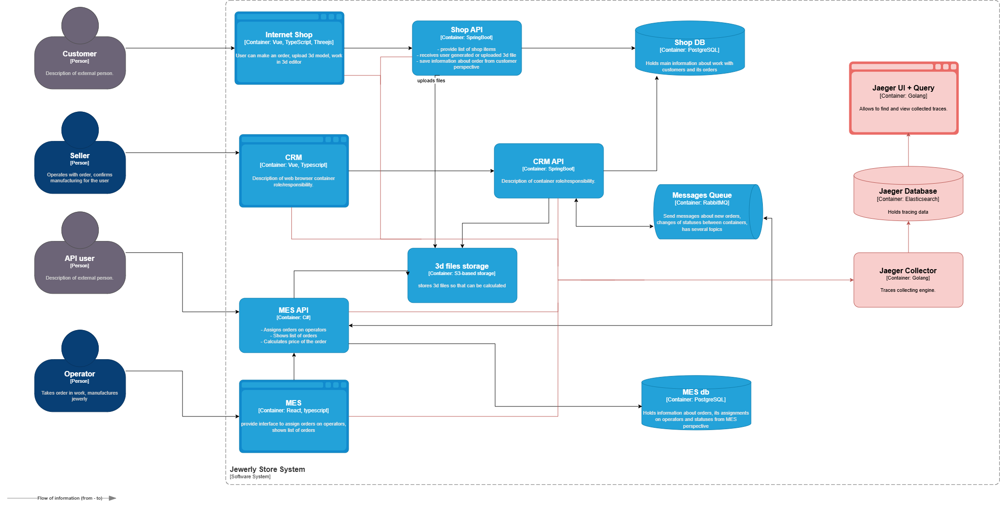
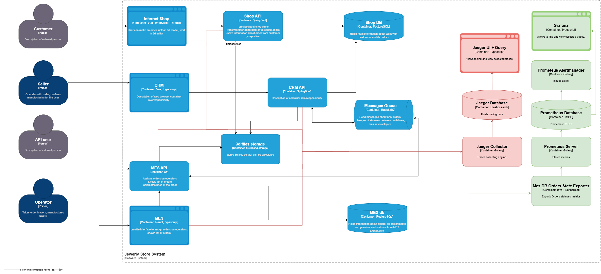

### Мотивация

Улучшится способность разбираться с проблемами как во время разработки, так и в Production.

В конечном счёте это повлияет на:

* TTM - time to market - быстрее будет delivery нового функционала, тк меньше времени будем проводить за отладкой
* MTTR - mean time to recovery - быстрее будем исправлять уже существующие дефекты

### Предлагаемое решение

Предлагается использовать Jaeger с Elasticsearch backend в самом простом варианте, см. https://www.jaegertracing.io/docs/1.76/architecture/ . Поначалу пишем напрямую в Jaeger, не внедряем Kafka, не используем отдельный OpenTelemetry collector.

Сервисы модифицируем, используя OpenTelemetry SDK.

### Компромиссы

Какие-то системы невозможно или тяжело модифицировать (CRM).

Также мало смысла внедрять трейсинг там, где цепочки вызовов очевидные или короткие.

### Аспекты безопасности

В трейсах могут содержаться чувствительные данные.

* Снаружи данная система должна быть недоступна - только офис / VPN
* Корректно должна быть настроена сеть, я не должен с хоста коллектора иметь возможность вызвать сервис, записать сообщение в Rabbit и тп - уязвимость в collector или ui не должна приводить к компрометации всего кластера
* К системе должны иметь доступ только авторизованные пользователи (например разработчики, участвующие в устранении проблем)
* Должен существовать процесс управления инцидентами, связанных с появлением нежелательных данных в трейсах, обеспечивающий своевременное исправление таких проблем и удаление трейсов с такими данными
* Данные из сервисов должны передаваться по протоколу, обеспечивающему шифрование  

### Автоматический мониторинг процесса прохождения заказа, полученные из данных трейсинга, и алертинг

Всё зависит от целей, которые преследуем.

Предположим это:

* Выявление роста и наличия проблемных заказов
* Отслеживание пути конкретного заказа

Для выявления проблемных заказов предлагается сделать компоненет - небольшое приложение, которое делает запросы в MES БД (не слишком часто) и экспортирует метрики вида "количество заказов в статусе таком-то", "возраст самого старого заказа в таком-то статусе" и тп и настроить алерты в Prometheus / Grafana. Запросы должны быть оптимизированными и не слишком частыми (БД и так нехорошо), возможно здесь поможет реплика БД. Это решение "в лоб", но оно самое дешёвое.

Для отслеживания пути конкретного заказа достаточно просто "протащить" trace_id по всем компонентам и CRM может быть проблемой, возможно в коде MES, когда он получает сообщение от CRM о смене статуса надо будет как-то восстанавливать trace_id по ID заказа.

