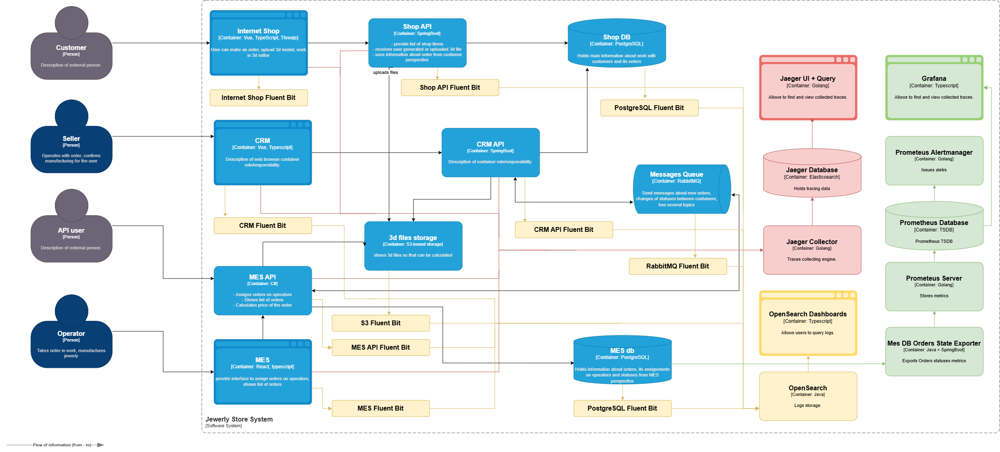

### Какие логи нужно собирать

INFO

Internet Shop

Данные:

* Время
* УЗ
* Успех / неудача
* Данные самой операции без ПД (см. ниже детализацию для некоторых операций)

Что логируем:

* Основные действия клиента
  * Пользователь завёл новый заказ или положил товары в пустую корзину - (ID заказа)
  * пользователь загрузил файл с 3D-моделью или создал его с помощью конструктора - (ID заказа, ID файла)
  * Пользователь нажал на кнопку «Сделать заказ» - (ID заказа)
* Вызовы Shop API

Shop API

Данные:

* Время
* УЗ
* Успех / неудача
* Данные самой операции без ПД (см. ниже детализацию для некоторых операций)

Что логируем:

* Вызовы API (соответствует действиям в Internet Shop)
  * Заведение нового заказа или помещение  товаров в пустую корзину - (ID заказа)
  * Загрузка файла с 3D-моделью или создание его с помощью конструктора - (ID заказа, ID файла)
  * Отправка заказа - (ID заказа)
* Запрос в MES API на расчет цены?

MES

Данные:

* Время
* УЗ
* Успех / неудача
* Данные самой операции без ПД (см. ниже детализацию для некоторых операций)

Что логируем:

* Действия операторов
  * Получение списка заказов
  * Оператор взял заказ в работу
  * Оператор выполнил заказ
  * Оператор начал упаковывать заказ
  * Заказ отправлен покупателю

MES API

Данные:

* Время
* Кто вызвал API - другой продавец? наш Shop API?
* УЗ - если применимо (например логин оператора)
* Успех / неудача
* Данные самой операции без ПД (см. ниже детализацию для некоторых операций)

Что логируем:

* Вызовы API
  * Получение списка заказов
  * Оператор взял заказ в работу (ID заказа, оператор)
  * Оператор выполнил заказ (ID заказа, оператор)
  * Оператор начал упаковывать заказ (ID заказа, оператор)
  * Заказ отправлен покупателю (ID заказа, оператор)
  * Расчёт цены - (ID заказа, цена)
* Отправка сообщения для CRM
* Получение сообщения из CRM

CRM

Данные:

* Время
* УЗ
* Успех / неудача
* Данные самой операции без ПД (см. ниже детализацию для некоторых операций)

Что логируем:

* Подтверждение заказа (ID заказа)
* Завершение заказа (ID заказа)

CRM API

Данные:

* Время
* УЗ
* Данные самой операции без ПД

Что логируем:

* Вызовы API
  * Подтверждение заказа (ID заказа)
  * Завершение заказа (ID заказа)
* Чтение сообщения от MES
* Отправка сообщения для MES

3d files storage

Ставим уровень INFO и смотрим, подходит ли он нам

Shop DB

Ставим уровень INFO и смотрим, подходит ли он нам

Messages Queue

Ставим уровень INFO и смотрим, подходит ли он нам

MES db

Ставим уровень INFO и смотрим, подходит ли он нам

### Другие уровни

* ERROR - логируем ошибки API
* WARN - аномалии исполнения - например слишком долго выполняется ручка API для получения списка заказов (если метрицируем), необычно большой файл 3D-модели и тп
* DEBUG - детально логируем основные места алгоритмов, точки ветвления кода, действия пользователя более подробно и тп

### Мотивация

* Поможет разбираться с жалобами пользователей постфактум - можно понять, что произошло, читая логи
* Временое увеличение уровня логирования для подозрительных кейсов поможет понять причины проблем "на лету" (в сочетании с трейсингом, если он есть)
* Наряду с мониторингом поможет понять количество ошибок, проактивно их исправлять

Как следствие - избежим потери денег.

Метрики:

* TTM - time to market - будем быстрее выпускать функционал - использование логов в процессе отладки ускорит разработку
* MTTR - mean time to recovery - будем быстрее исправлять ошибки с помощью логов
* Escalation Rate - поддержка сможет в большем числе случаев самостоятельно понимать, что произошло, без привлечения разработки
* MTTD - mean time to detection - проактивный анализ логов позволит выявлять ошибки до того, как на них пожалуется пользователь

### Предлагаемое решение

Возьмём Opensearch (обоснование в соответствующем пункте).

Соответственно в самой простой конфигурации будут:

* Fluent Bit для компонент - для всех компонент, включая Rabbit, Postgres, S3 и т.п. Fluent Bit можно настроить
* OpenSearch Core - хранилище
* OpenSesrch Dashboards - UI

Компоненты, относящиеся к логированию, выделены жёлтым цветом.

Доступ к логам будут иметь разработка и поддержка.

Компоненты системы логгирования (кроме Fluent Bit) должны располагаться в изолированном сегменте сети - грубо говоря я не должен быть способен сломать MES API в результате эксплуатации уязвимости Dashboards.

В логи не должны попадать персональные данные, этого можно добиться:

* Автоматическим анализом логов
* Соответствующим ревью кода
* Использованием соответствующих библиотек логирования с маскированием чувствительных данных
* Процедурами работы с инцидентами, если логи всё-таки записаны (все ознакомлены с проблемой, исправлению придаётся высокий приоритет и тп)

Размер логов надо считать исходя из нагрузки, данных для этого нет.

Время хранения должно быть достаточным для разбора инцидентов, команды не сразу берутся за исправление, умозрительно от 2х недель, но надо изучать специфику багов.

Индекс на систему - пишут, что это анти-паттерн.

### Необходимые мероприятия для превращения системы сбора логов в систему анализа логов

OpenSearch уже предоставляет возможности для ручного анализа логов, так что это уже в некотором роде система анализа в текущей конфигурации.

Что касается алертов и детекции аномалий - масштаб организации и степень зрелости процессов и продукта с технической точки зрения говорят о том, что на данном этапе будет достаточно алертов, работающих поверх метрик, собираемых с самих сервисов.

### Критерии для выбора технологии для работы с логами

| Критерий | ELK | OpenSearch | Splunk | Grafana Loki |
|---|---|---|---|---|
| Поддержка сбора логов стандартных компонент - PostgreSQL, Rabbit MQ, S3 | Да | Да | Да | Да |
| Цена | Платно / Умеренно дорого | Бесплатно | Платно / Дорого | Бесплатно |
| Общая стоимость владения | Низкая | Средняя | Высокая | Очень низкая |
| Распространенность экспертизы | Высокая | Средняя | Низкая | Высокая |
| Поддержка в Yandex Cloud облаке | Только Elasticsearch как Managed Service | Да | Нет | Как приложение в Cloud Market |
| Функционал поиска | Полноценный | Полноценный | Полноценный | Базовый | 
| Перспективы развития | Плато | Рост | Плато | Рост |

По совокупности характеристик выбран OpenSearch, Loki выглядит как решение больше для стартапа.